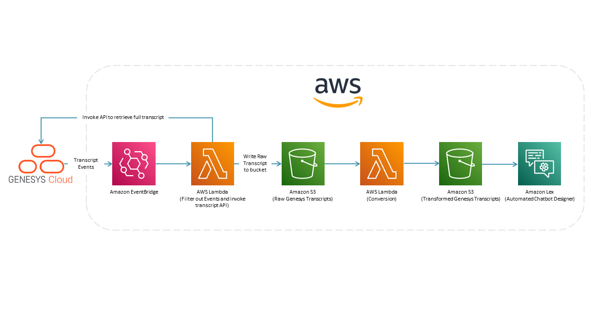

# Expedite your Genesys Cloud Amazon Lex bot design with the Amazon Lex automated chatbot designer

> View the full [Expedite your Genesys Cloud Amazon Lex bot design with the Amazon Lex automated chatbot designer Blueprint](https://developer.mypurecloud.com/blueprints/automated-chabot-with-amazon-lex/ "Expedite your Genesys Cloud Amazon Lex bot design with the Amazon Lex automated chatbot designer Blueprint") in the Genesys Cloud Developer Center.

This Genesys Cloud Developer Blueprint shows how you can implement an architecture using Amazon EventBridge, Amazon Simple Storage Service (Amazon S3), and AWS Lambda to automatically collect, transform, and load your Genesys call transcripts in the required format for the Amazon Lex automated chatbot designer. You can then run the automated chatbot designer on your transcripts, be given recommendations for bot design, and streamline your bot design journey.

