:::{"alert":"primary","title":"About Genesys Cloud Blueprints","autoCollapse":false} 
Genesys Cloud blueprints were built to help you jump-start building an application or integrating with a third-party partner. 
Blueprints are meant to outline how to build and deploy your solutions, not a production-ready turn-key solution.
 
For more details on Genesys Cloud blueprint support and practices 
please see our Genesys Cloud blueprint [FAQ](https://developer.genesys.cloud/blueprints/faq) sheet.
:::

The rise of artificial intelligence (AI) has created opportunities to improve the customer experience in the contact center space. Machine learning (ML) technologies continually improve and power customer experience by providing solutions for capabilities such as self-service bots, live call analytics, and post-call analytics. Self-service bots integrated with your call center can help you achieve decreased wait times, intelligent routing, decreased time-to-resolution through self-service functions or data collection, and improved net promoter scores (NPS). Some examples include a customer calling to check on the status of an order and receiving an update from a bot, or a customer needing to submit for license renewal and the chatbot collecting the necessary information, which it later hands over to an agent for processing.

Using [Amazon Lex](https://aws.amazon.com/lex/) bots, you can introduce the [conversational AI](https://aws.amazon.com/lex/) capabilities in your call center. Amazon Lex uses automatic speech recognition (ASR) and natural language understanding (NLU) to understand the customer’s needs and assist them on their journey.

Genesys Cloud provides a contact center platform in a public cloud model that enables quick and simple integration of [AWS Contact Center Intelligence](https://aws.amazon.com/machine-learning/ml-use-cases/contact-center-intelligence/) (AWS CCI) to transform the modern contact center from a cost center into a profit center. 

The integration of Genesys Cloud with Amazon Lex enables self-service, intelligent routing, and data collection capabilities. However, before you begin, you may be unsure of where to start on your bot design journey. To help you get started, the [Amazon Lex automated chatbot designer](https://aws.amazon.com/lex/chatbot-designer/) provides a straightforward and intuitive way of designing chatbots that can reduce bot design time from weeks to hours. You can then refine the bot design using your current call transcripts to launch faster conversational experiences. To create the initial bot design, the Amazon Lex automated chatbot designer requires transcripts to be in a certain format.

This Genesys Cloud Developer Blueprint shows how you can implement an architecture using [Amazon EventBridge](https://aws.amazon.com/eventbridge/), [Amazon Simple Storage Service](https://aws.amazon.com/s3/) (Amazon S3), and [AWS Lambda](https://aws.amazon.com/lambda/) to automatically collect, transform, and load your Genesys call transcripts in the required format. You can then run the automated chatbot designer on your transcripts, receive recommendations for bot design, and get started with your bot design journey. Deploy all the components used in this solution with the Terraform Genesys Cloud CX as Code provider AWS provider.
* [Scenario](#scenario "Goes to the Scenario section")
* [Solution components](#solution-components "Goes to the Solution components section")
* [Prerequisites](#prerequisites "Goes to the Prerequisites section")
* [Implementation steps](#implementation-steps "Goes to the Implementation steps section")
* [Additional resources](#additional-resources "Goes to the Additional resources section")


## Scenario

The solution workflow consists of the following steps:

1. Genesys Cloud sends iterative transcript events to your EventBridge event bus.

2. AWS Lambda receives the iterative transcripts from EventBridge, and determines when a conversation is complete. It then invokes the Transcript API within Genesys Cloud and drops the full transcript in an Amazon S3 bucket.

3. AWS Lambda converts transcript into the format that is required for Amazon Lex automated chatbot designer and copies it to an Amazon S3 bucket.

4. The Amazon Lex automated chatbot designer uses ML to build an initial bot design based on the transcripts.

## Solution components

* **Genesys Cloud** - A suite of Genesys cloud services for enterprise-grade communications, collaboration, and contact center management. Contact center agents use the Genesys Cloud user interface.
* **Amazon Web Services (AWS) Cloud** - A set of cloud computing capabilities managed by Amazon. 
* **AWS Lambda** - A serverless computing service for running code without creating or maintaining the underlying infrastructure.
* **Amazon EventBridge** - A scalable, serverless event bus that streams real-time data to selected targets based on custom routing rules.
* **Amazon S3** - An object storage service offering industry-leading scalability, data availability, security, and performance.

## Prerequisites

### Specialized knowledge

* Administrator-level knowledge of Genesys Cloud
* AWS Cloud Practitioner-level knowledge of AWS IAM, AWS EventBridge, AWS Lambda, and Amazon S3
* Familiarity with Terraform or similar Infrastructure-as-Code tools

### Genesys Cloud account

* A Genesys Cloud license. For more information, see [Genesys Cloud Pricing](https://www.genesys.com/pricing "Opens the Genesys Cloud pricing page") on the Genesys website.
* Master Admin role. For more information, see [Roles and permissions overview](https://help.mypurecloud.com/?p=24360 "Opens the Roles and permissions overview article") on Genesys Cloud Resource Center.
* CX as Code. For more information, see [CX as Code](https://developer.genesys.cloud/devapps/cx-as-code/ "Goes to the CX as Code page") on Genesys Cloud Developer Center.

### Development tools that run in your local environment

* Terraform (the latest binary). For more information, see [Download Terraform](https://www.terraform.io/downloads.html "Goes to the Download Terraform page") on the Terraform website.

## Implementation steps

Download the repository that contains the project files:

1. Clone the [automated-chabot-with-amazon-lex repository](https://github.com/GenesysCloudBlueprints/automated-chabot-with-amazon-lex "Opens the automated-chabot-with-amazon-lex repository in GitHub")

You can implement Genesys Cloud objects manually or with Terraform.
* [Configure Genesys Cloud and Amazon using Terraform](#configure-genesys-cloud-and-amazon-using-terraform)
* [Configure Genesys Cloud and Amazon manually](#configure-genesys-cloud-and-amazon-manually)


### Configure Genesys Cloud and Amazon using Terraform

#### Set up Genesys Cloud

1. Open a Terminal window and set the following environment variables:

 * `GENESYSCLOUD_OAUTHCLIENT_ID` - The Genesys Cloud client credential grant ID that CX as Code executes against. 
 * `GENESYSCLOUD_OAUTHCLIENT_SECRET` - The Genesys Cloud client credential secret that CX as Code executes against. 
 * `GENESYSCLOUD_REGION` - The Genesys Cloud region in your organization.

2. Run Terraform in the folder in which you set the environment variables. 

#### Configure your Terraform build

Set the following values in the **/terraform/dev.auto.tfvars** file that are specific to your Genesys Cloud organization:

* `aws_account_id` - The AWS Account ID associated with the event source creation.
* `aws_region` - The AWS region where the event source is made available for an event bus. For example, `us-east-1`.
* `aws_event_bus_name` - A unique name appended to the event source in the AWS account. The name can be up to 64 characters and includes lower or uppercase letters, numbers, and the special characters '.', '-', and '_'.
* `genesys_cloud_organization_id` - Your Genesys Cloud organization ID. To get the organization ID, in Genesys Cloud, go to **Admin** > **Organization Settings** > **Organzation Details tab** **Advanced**.
* `client_id` - The value of your OAuth Client ID to be used for the data action integration.
* `client_secret`- The value of your OAuth Client secret to be used for the data action integration.
* `gen_cloud_env` - The Genesys Cloud region where the event source will be made available for an event bus. For example, `us-east-1`.

The following is an example of the **dev.auto.tfvars** file.

```
# AWS Credentials
aws_account_id                = "aws-account-id"
aws_region                    = "us-east-1"
aws_event_bus_name            = "automated-chatbot-with-amazon-lex"

# Genesys
genesys_cloud_organization_id = "genesys-cloud-org-id"
client_id                     = "your-client-id"
client_secret                 = "your-client-secret"
gen_cloud_env                 = "us-east-1"
```

#### Run Terraform

You are now ready to run this blueprint solution for your organization.

1. Change to the **/terraform** folder.
2. Run the following commands:

* `terraform init` - Initializes a working directory that contains the Terraform configuration files.

* `terraform plan` - Executes a trial run against your Genesys Cloud organization and shows you a list of all the Genesys Cloud resources it creates. Review this list and make sure that you are comfortable with the plan before you continue.

* `terraform apply --auto-approve` - Creates and deploys the necessary objects in your Genesys Cloud account. The `--auto-approve` flag completes the required approval step before the command creates the objects.

After the `terraform apply --auto-approve` command successfully runs, you see the output with the number of objects that Terraform successfully created. Keep the following points in mind:

* This project assumes that you run this blueprint solution with a local Terraform backing state. This means that the `tfstate` files are created in the same folder where you run the project. Terraform recommends that you use local Terraform backing state files only if you run from a desktop and are comfortable with the deleted files.

* As long as you keep your local Terraform backing state projects, you can tear down this blueprint solution. To tear down the solution, change to the `docs/terraform` folder and issue the `terraform destroy --auto-approve` command. This command destroys all objects that the local Terraform backing state currently manages.

### Configure Genesys Cloud and Amazon manually

#### Deploy the Genesys EventBridge integration

To enable the EventBridge integration with Genesys Cloud, complete the following steps:

1. Log in to the Genesys Cloud environment.
2. In **Admin** > **Integrations** > **Add Integrations** > **Amazon EventBridge Source**.
3. On the Configuration tab, provide the following information:
   * In the **AWS Account ID** field, enter your AWS account ID.
   * In the **AWS Account Region** field, enter the Region where you want EventBridge to be set up.
   * In the **Event Source Suffix** field, enter a suffix (for example, genesys-eb-poc-demo).
4. Save your configuration.
  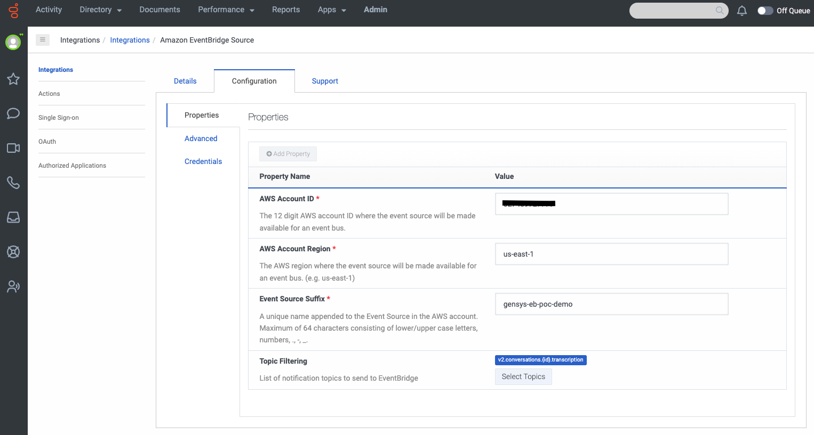
5. On the EventBridge console, from the navigation pane, choose **Integration** > **Partner event sources**. Search for an event source by the name `aws.partner/genesys.com/…/genesys-eb-poc-demo`.
  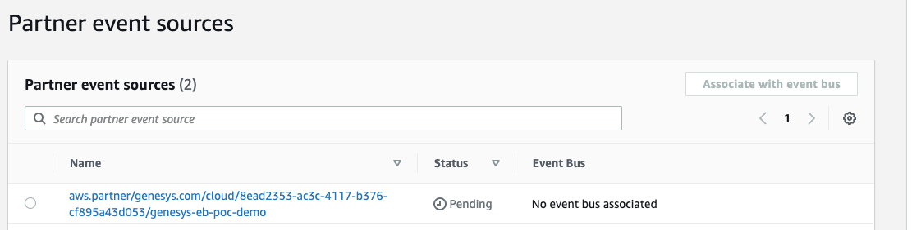
6. Select the partner event source and click **Associate with event bus**. The status changes from **Pending** to **Active**. 

  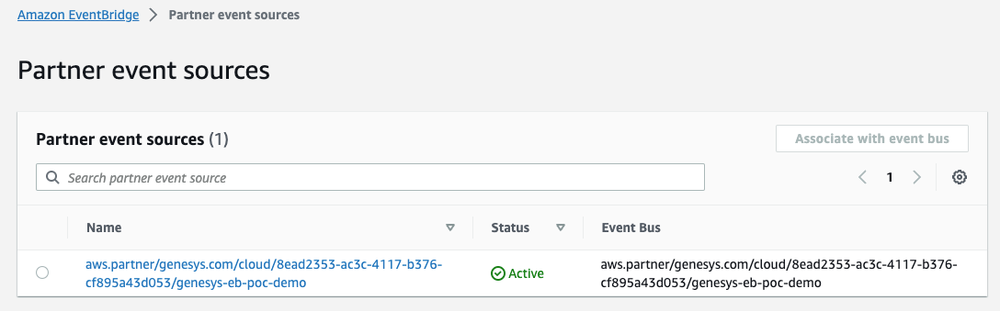

This sets up the EventBridge configuration for Genesys.

### Set up Genesys Cloud OAuth credentials

1. In **Admin** > **Integrations** > **OAuth**, choose **Add Client**.
2. On the **Client Details** tab, provide the following information:
  * In the **App Name** field, enter a name (for example, `TranscriptInvoke-creds`).
  * In the **Grant Types** field, select **Client Credentials**.
  Make sure you are using the right role that has access to invoke the Transcribe APIs.
3. Click **Save**.

This generates new values for **Client ID** and **Client Secret**. Copy these values to use in the next section, where you configure the template for the solution.
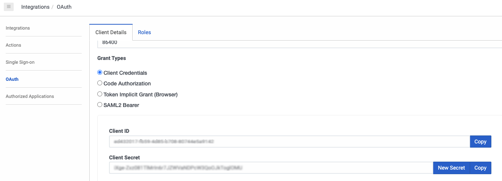

### Deploy the solution

After you set up the Genesys EventBridge integration, you can deploy an [AWS Serverless Application Model](https://aws.amazon.com/serverless/sam/) (AWS SAM) template, which deploys the remainder of the architecture. To deploy the solution in your account, complete the following steps:
1. Install AWS SAM if not installed already. For more information, see [Installing the AWS SAM CLI](https://docs.aws.amazon.com/serverless-application-model/latest/developerguide/install-sam-cli.html).
2. Download the [GitHub repo](https://github.com/aws-samples/lex-automated-chatbot-designer-genesys-transcripts) and unzip to your directory.
3. Navigate to the `lex-automated-chatbot-designer-genesys-transcripts` folder and run the following commands:
  ```
  sam build --use-container
  sam deploy --guided
  ```
The sam build --use-container command builds the source of your application. The sam deploy --guided command  packages and deploys your application to AWS, with a series of prompts:

 * **Stack Name**: The name of the stack to deploy to [AWS CloudFormation](http://aws.amazon.com/cloudformation). This should be unique to your account and region. A good starting point would be something that matches your project name.
 * **AWS Region**: The AWS region you want to deploy your app to. Make sure it is deployed in the same region as the EventBridge.
 * **Parameter GenesysBusname**: This is the bus name that was created when Genesys integration was configured. The pattern of the bus name should look like `aws.partner/genesys.com/*`
 * **Parameter ClientId**: The parameter value from Genesys Cloud CX that was generated during the Set up Genesys Cloud OAuth credentials section.
 * **Parameter ClientSecret**: The parameter value from Genesys Cloud CX that was generated during the Set up Genesys Cloud OAuth credentials section.
 * **Parameter FileNamePrefix**: This is the file name prefix for the target transcript file in the raw bucket. There is a default value associated with it, but can be changed.
 * **Parameter GenCloudEnv**: This is the cloud environment for the specific Genesys organization. Genesys is available in more than 15 regions world wide today, so this value is mandatory and should point to the environment where your organization is created in Genesys eg: usw2.pure.cloud
 * **Confirm changes before deploy**: If set to Yes, any change sets will be shown to you before execution for manual review. If set to No, the AWS SAM CLI will automatically deploy application changes. 
 * **Allow SAM CLI IAM role creation**: Many AWS SAM templates, including this example, create [AWS IAM](https://aws.amazon.com/iam/) roles required for the AWS Lambda function(s) included to access AWS services. By default, these are scoped down to minimum required permissions. To deploy an AWS CloudFormation stack which creates or modifies IAM roles, provide the `CAPABILITY_IAM` value for `capabilities`. If you do not grant the permission to deploy this example through this prompt, you must explicitly pass `--capabilities CAPABILITY_IAM` to the `sam deploy` command.
 * **Save arguments to samconfig.toml**: If set to Yes, your choices are saved to a configuration file inside the project, so that in the future you can just re-run `sam deploy` without parameters to deploy changes to your application.

 After you deploy your AWS SAM application in your account, you can test that Genesys transcripts are being sent to your account and being transformed into the required format for the Amazon Lex automated chatbot designer.

## Test the solution

After you set up the Genesys EventBridge integration and deployed the solution, you can make test calls and validate that files are ending up in the S3 bucket for the transformed files. At a high level, you need to perform the following steps:
1. Make a test call to your Genesys instance to create a transcript.
2. Wait a few minutes and check the TransformedTranscript bucket for the output.

### Run the automated chatbot designer

Before you run the automated chatbot designer, ensure that you have trascripts of at least few days in your Amazon S3 bucket. 

Once the transcripts are ready, run the automated chatbot designer through the Amazon Lex console using the steps in this section. For more information about the minimum and maximum number of turns for the service, see [Prepare transcripts](https://docs.aws.amazon.com/lexv2/latest/dg/designing-import.html#import-prepare).

1. On the Amazon Lex V2 console, choose **Bots in the navigation pane**. Click **Create bot**.
  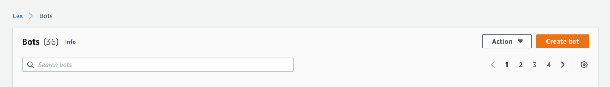
2. Select **Start with transcripts** as the creation method. 
3. On the **Bot Configuration** page, enter the following detaiis:
 * Bot Name.  Enter the bot a name (for this example, `InsuranceBot`) and provide an optional description.
 * In the **IAM Permissions** section, 
select **Create a role with basic Amazon Lex permissions** and use this as your runtime role.

  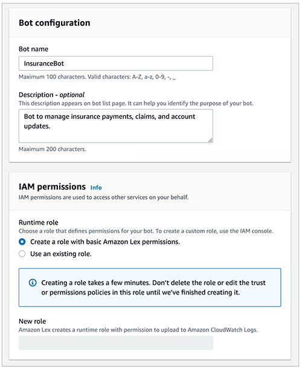
* After you fill out the other fields, choose **Next** to proceed to the language configuration.
4. In the **Add language to bot** page, choose the language and voice for your interaction.
  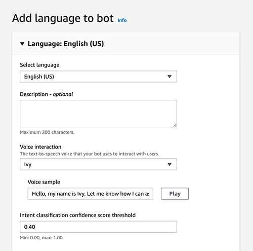
5. Specify the Amazon S3 location of the transcripts that the solution has converted for you.
6. Add additional local paths if you have a specific a folder structure within your S3 bucket.
  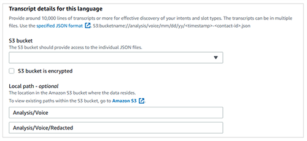
7. Apply a filter (date range) for your input transcripts.
  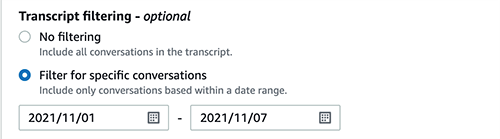
8. Click **Done**.

You can use the status bar on the Amazon S3 console to track the analysis. Within a few hours, the automated chatbot designer generates a chatbot design that includes user intents, sample phrases associated with those intents, and a list of all the information required to fulfill them. The amount of time it takes to complete training depends on several factors, including the volume of transcripts and the complexity of the conversations. Typically, 600 lines of transcript are analyzed every minute.

1. Choose **Review** to view the intents and slot types discovered by the automated chatbot designer. The **Intents** tab lists all the intents along with sample phrases and slots, and the **Slot types** tab provides a list of all the slot types along with slot type values.
  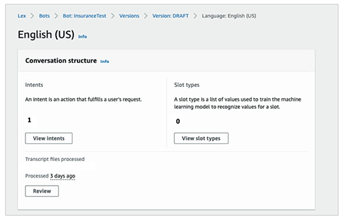
  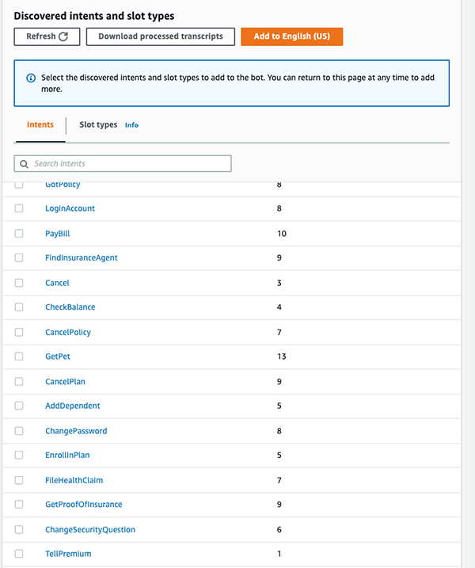
  
2. Choose any of the intents to review the sample utterances and slots. For example, in the following screenshot, we choose `ChangePassword` to view the utterances.
  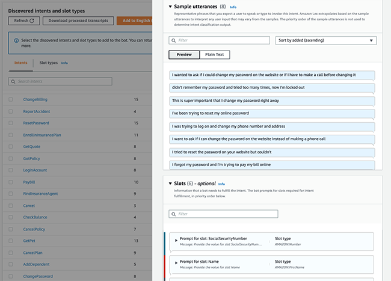
3. Choose the **Associated transcripts tab** to review the conversations used to identify the intents.
  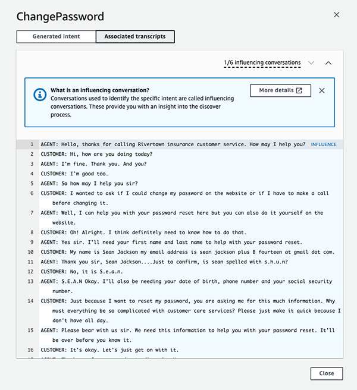
4. After you review the results, select the intents and slot types relevant to your use case and choose **Add**. This adds the selected intents and slot types to the bot. You can now iterate on this design by making changes such as adding prompts, merging intents or slot types, and renaming slots.
  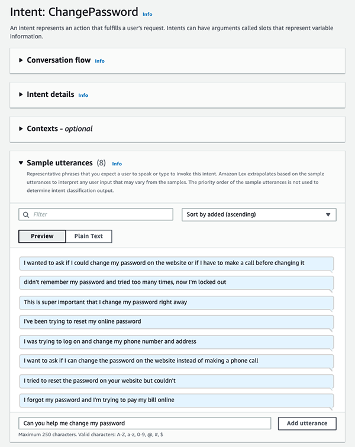

You have now used the Amazon Lex automated chatbot designer to identify common intents, utterances mapped to those intents, and information that the chatbot needs to collect to fulfill certain business functions.

### Clean up

When you are finished, clean up your resources by using the following command within the AWS SAM CLI:

```
sam delete
```

## Additional resources

* [Amazon EventBridge](https://aws.amazon.com/eventbridge/)
* [Amazon S3](https://aws.amazon.com/s3/)
* [AWS Lambda](https://aws.amazon.com/lambda/)
* [GitHub repository automated-chabot-with-amazon-lex](https://github.com/GenesysCloudBlueprints/automated-chabot-with-amazon-lex)
* [GitHub lex-automated-chatbot-designer-genesys-transcripts repository](https://github.com/aws-samples/lex-automated-chatbot-designer-genesys-transcripts)

## Authors


**Joe Morotti** is a Solutions Architect at Amazon Web Services (AWS), helping Enterprise customers across the Midwest US. He has held a wide range of technical roles and enjoy showing customer’s art of the possible. In his free time, he enjoys spending quality time with his family exploring new places and over analyzing his sports team’s performance.

---


**Anand Bose** is a Senior Solutions Architect at Amazon Web Services, supporting ISV partners who build business applications on AWS. He is passionate about creating differentiated solutions that unlock customers for cloud adoption. Anand lives in Dallas, Texas and enjoys travelling.